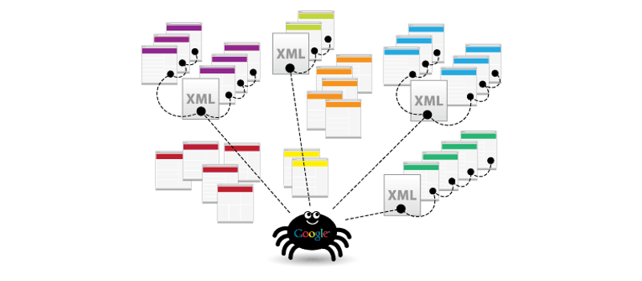
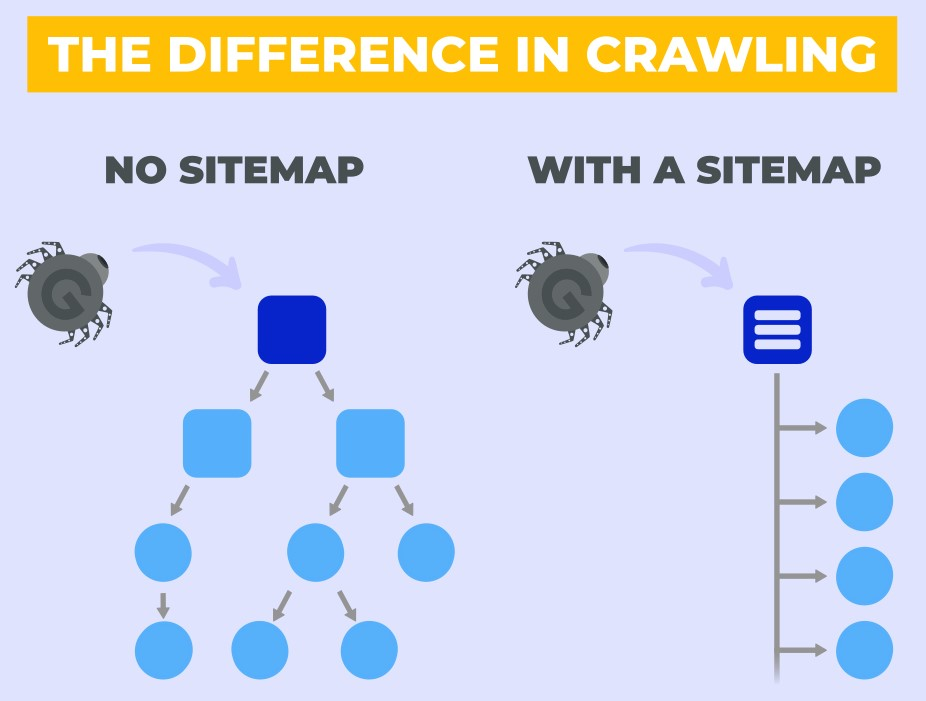

# Sitemap-Generation-using-Python
Creating Sitemap Files for a website using Python

### What is Sitemap:
A sitemap is a file that provides information about pages, images, videos included on your website. 
Sitemaps are used by search engines like Google for efficient crawling. 

There are various sitemap formats such as XML, RSS, Text. XML sitemap format is popularly used and is thus demostrated in this project. 

### Use of Sitemap:
A sitemap is used to provide specific information about your website namely, webpages, images on the webpages. 
For example: 
A video sitemap will provide information about the video location, video title, rating and much more. 
An image sitemap will include the location of the images included in a specific webpage. 

### Types of Sitemap:
Following are the 3 types of sitemaps used widely: 

URL Sitemap (Basic Sitemap that most websites use) 
Image Sitemap 
Video Sitemap 

### Sample XML Sitemap:

\<?xml version="1.0" encoding="UTF-8"?> 
\<urlset xmlns="http://www.sitemaps.org/schemas/sitemap/0.9"> 
    &emsp;\<url> 
        &emsp;&emsp;\<loc> http://www.abc.com/ \</loc> 
        &emsp;&emsp;\<lastmod> 2022-09-01 \</lastmod> 
        &emsp;&emsp;\<changefreq> daily \</changefreq> 
        &emsp;&emsp;\<priority> 0.9 \</priority>   
    &emsp;\</url> 
\</urlset>

### Contents of the Project:

Sitemap-Generation.ipynb: It is a Jupyter Notebook that explains how you can construct a basic sitemap for website and other sitemap variants as well. For demonstration, we have crawled Udemy homepage and constructed sitemap files using the URLs. 

Sample Sitemap Files: This folder contains all the generated sitemap files, when the above notebook is run. 

robots.txt: It is a file in which sitemap / sitemap index file path needs to be mentioned in order to let the crawler know he location. 

Screenshots: This folder contains snaps of sitemap file and sitemap_index file generated through the program. It also contains snaps of robots.txt in which how one can include the sitemap file paths. 

To access the Sitemap Generation code, click <a href="https://github.com/shalaka-thorat/Sitemap-Generation-using-Python/blob/main/Sitemap-Generation.ipynb">Here</a>
    
## References:

1) Sitemap: https://www.sitemaps.org/protocol.html
2) Splitting Sitemaps and Constructing Sitemap Index: https://developers.google.com/search/docs/crawling-indexing/sitemaps/overview
3) Image Sitemap: https://developers.google.com/search/docs/crawling-indexing/sitemaps/image-sitemaps
4) Video Sitemap: https://developers.google.com/search/docs/crawling-indexing/sitemaps/video-sitemaps

## 
 

